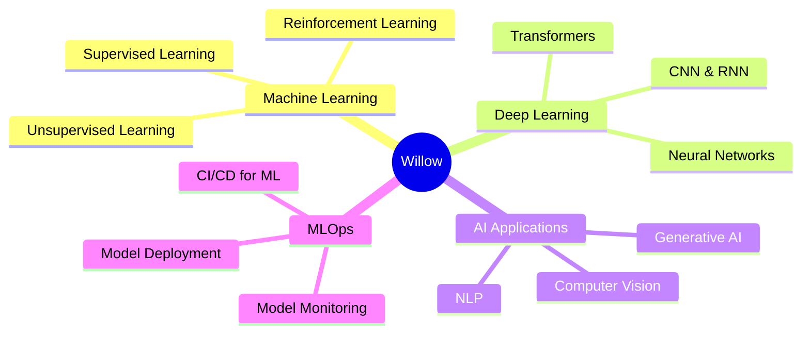

<div align="center">

<!-- Animated Header -->


<h1>👋 Hi, I'm Srija</h1>
<h3>🤖 Machine Learning Engineer | AI Enthusiast | B.Tech ECE Student</h3>

</div>

---

<!-- Profile Counters -->
<div align="center">
  


</div>

<br>

<!-- About Me Section -->
<div align="center">
  
##  About Me

</div>

<br>

```typescript
const Willow = {
    pronouns: "She" | "Her",
    location: "India 🇮🇳",
    education: "B.Tech in Electronics & Communication Engineering",
    role: "Machine Learning Engineer",
    currentFocus: [
        "Artificial Intelligence", 
        "Machine Learning", 
        "Deep Learning",
        "Neural Networks",
        "Computer Vision",
        "Natural Language Processing"
    ],
    learning: [
        "Advanced ML Algorithms", 
        "MLOps & Model Deployment", 
        "Research & Innovation"
    ],
    hobbies: ["ML Research", "Building AI Models", "Kaggle Competitions"],
    funFact: "I believe AI will change the world, and I want to be part of it!  🚀",
    askMeAbout: ["AI/ML", "Deep Learning", "Python", "Data Science", "ECE"],
    reachMeOut: "Connect with me on LinkedIn or Instagram!"
};
```

<br>

---

<!-- Animated Skills Section -->
<div align="center">

## 💻 Tech Stack & Skills

</div>

<br>

<div align="center">

### 🤖 Machine Learning & AI


### 📊 Data Science & Analytics


### 💻 Programming Languages


### 🗄️ Databases & Cloud


### 🛠️ Tools & Technologies


</div>

---

<!-- GitHub Stats -->
<div align="center">

### GitHub Statistics

<br>


</div>

---

<!-- Connect Section -->
<div align="center">

##  Connect With Me

<br>

[](https://www.linkedin.com/in/anast-sing)
[](https://instagram.com/nastenkaaaaaa09)
[](https://github.com/willow788)
[](mailto:your.email@gmail.com)

<br>

### 💬 Ask me about AI/ML, Deep Learning, or anything tech! I'm happy to help!  😊

</div>

---

<!-- Inspirational Quote -->
<div align="center">

## 💭 Inspiration

<br>

> **"The development of full artificial intelligence could spell the end of the human race… It would take off on its own, and re-design itself at an ever-increasing rate."**  
> *— Stephen Hawking*

<br>

> **"Machine learning is the last invention that humanity will ever need to make."**  
> *— Nick Bostrom*

</div>

---

<!-- Current Focus -->
<div align="center">

## 🎯 Current Focus & Learning Path

<br>



</div>

---

<!-- Animated Footer -->
<div align="center">

<br>

### ⭐ Show some love by starring repositories you find interesting! ⭐

<br>


### 🌟 "In ML we trust, in data we believe!" 🌟

<br>

<p align="center">
  
  
  
</p>

**Made with ❤️ and lots of ☕ | Powered by Machine Learning**

</div>
